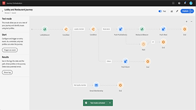
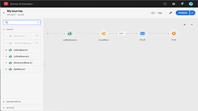
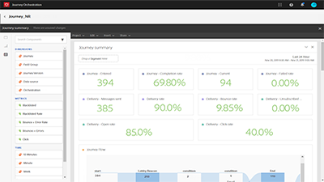

# Overview

[!UICONTROL Journey Orchestration] is an application service integrated with the Adobe Experience Platform. It allows you to build real-time orchestration use cases leveraging contextual data stored in events or data sources.

## What's new

* **[Finding help within the Journey Orchestration interface](/help/how-to-find-help-with-journey-orchestration.md)**
     
    *Understand where you can quickly find answers to your questions around [!UICONTROL Journey Orchestration], how to contact support, and where to log support tickets, as well as how you can give us feedback.*

## Staff Picks

<table>
<tr>
  <td>
    
    

      <a href="./communication-channels/email/profile-substitution.md">
    <strong>Understanding [!UICONTROL Journey Orchestration]</strong>
    </a>
    

    

    <em>Understand the concept of [!UICONTROL Journey Orchestration], the types of use cases it enables and the key elements of how [!UICONTROL Journey Orchestration ]works.</em>
    

  </td>
  <td>
    
    

      <a href="./create-a-journey.md">
    <strong>Create a Journey (video)</strong>
    </a>
    

    

    <em>Learn how to create a new journey, start with an event, use [!UICONTROL orchestrations controls] to control the flow and timing of a journey, and use actions to engage at points in the journey.</em>
    

  </td>
  <td>
   
    

      <a href="./reporting.md">
    <strong>Analyze a Journey via Reporting Tools</strong>
    </a>
    

    

    <em>Learn how to navigate to reporting for your journey, how to customize date ranges for your report and how to save a reporting template for future use. </em>
    

  </td>
</tr>
</table>

## Additional Resources

* [Journey Orchestration Help Center](https://docs.adobe.com/content/help/en/journeys/using/journey-orchestration-home.html)
* [Adobe Experience Platform Tutorials](https://docs.adobe.com/content/help/en/platform-learn/tutorials/overview.html)
  